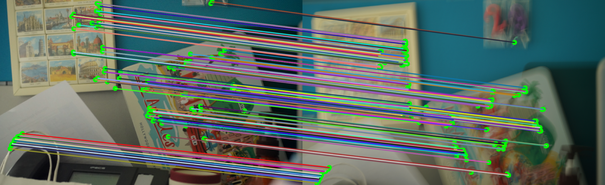

<p align="center">
  <h1 align="center"> <ins>BALF</ins> ⚡<br>Simple and Efficient Blur Aware Local Feature Detector</h1>
  <h3 align="center">WACV 2024</h3>
  <p align="center">
    <span class="author-block">
      <a href="https://ericzzj1989.github.io/">Zhenjun Zhao</a>
    </span>&nbsp;&nbsp;&nbsp;&nbsp;
  </p>

  <div align="center">
      <a href="https://arxiv.org/abs/2211.14731"></a>  
      <a href="https://ericzzj1989.github.io/balf"></a>  
  </div>

</p>

<p align="center">
  <a href="https://arxiv.org/abs/2211.14731">
    
  </a>
  <br>
  <em>BALF is able to detect well localized and repeatable keypoints from both sharp and blurred images.</em>
</p>

##

## TODO List

- [x] Release the training code.
- [x] Release the testing code.
- [x] Release the model checkpoint.
- [ ] Add installation and usage guidance.
- [ ] Release the Blur-HPatches dataset.

## Installation

Install this repo using pip:

```bash
git clone https://github.com/ericzzj1989/BALF.git && cd BALF
python -m pip install -e .
```

## Demo
Below we show how DeDoDe can be run, you can also check out the [demos](demo)
```python
from balf.utils import test_utils
from balf.configs import config
from balf.model import get_model
from demo import demo_match
from third_party.hardnet.hardnet_pytorch import HardNet

device = torch.device('cuda' if torch.cuda.is_available() else 'cpu')
args, cfg = config.parse_test_config()

detector = get_model.load_model(cfg['model'])
_,_ = get_model.load_test_pretrained_model(model=detector, filename=args.ckpt_file)
detector = detector.eval().to(device)

descriptor = HardNet()
checkpoint_descriptor = torch.load(args.ckpt_descriptor_file, weights_only=True)
descriptor.load_state_dict(checkpoint_descriptor['state_dict'])
descriptor = descriptor.eval().to(device)

im_rgb1, im_gray1 = demo_match.load_im('media/im1.jpg')
im_rgb2, im_gray2 = demo_match.load_im('media/im2.jpg')

matches1, matches2 = demo_match.extract_matches(
  args,
  im_rgb1, im_gray1, im_rgb2, im_gray2,
  detector, descriptor, device)

Image.fromarray(demo_match.draw_matches(im_rgb1, matches1, im_rgb2, matches2)).save("demo/matches.png")

```


## Acknowledgments

The author thanks <a href="https://ethliup.github.io/">Peidong Liu</a> and <a href="http://www.mae.cuhk.edu.hk/~bmchen">Ben M. Chen</a> for supporting.

## Citation

If you find this code or paper useful, please cite:

```bibtex
@InProceedings{Zhao_2024_WACV,
    author    = {Zhao, Zhenjun},
    title     = {BALF: Simple and Efficient Blur Aware Local Feature Detector},
    booktitle = {Proceedings of the IEEE/CVF Winter Conference on Applications of Computer Vision (WACV)},
    month     = {January},
    year      = {2024},
    pages     = {3362-3372}
}
```

## Contact
Contact [Zhenjun Zhao](mailto:ericzzj89@gmail.com) for questions, comments and reporting bugs.
